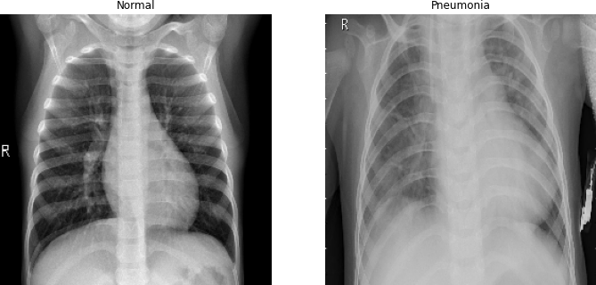
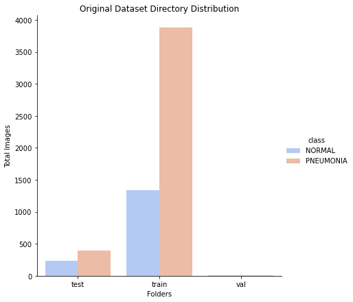
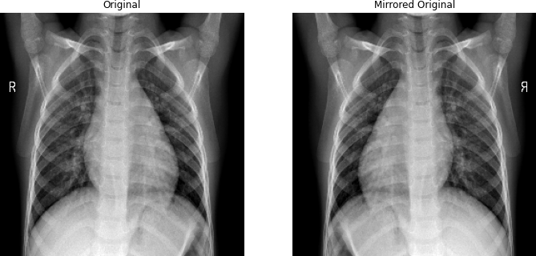
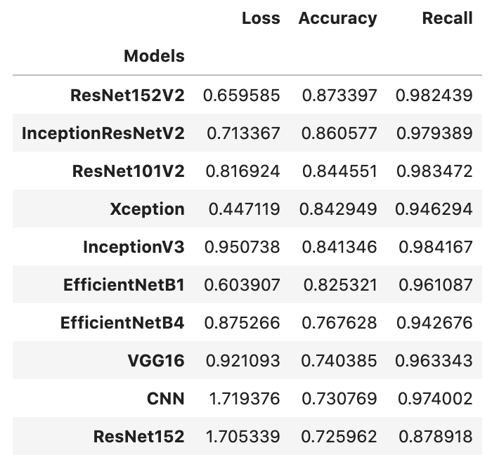
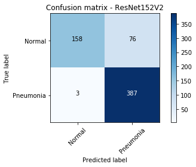
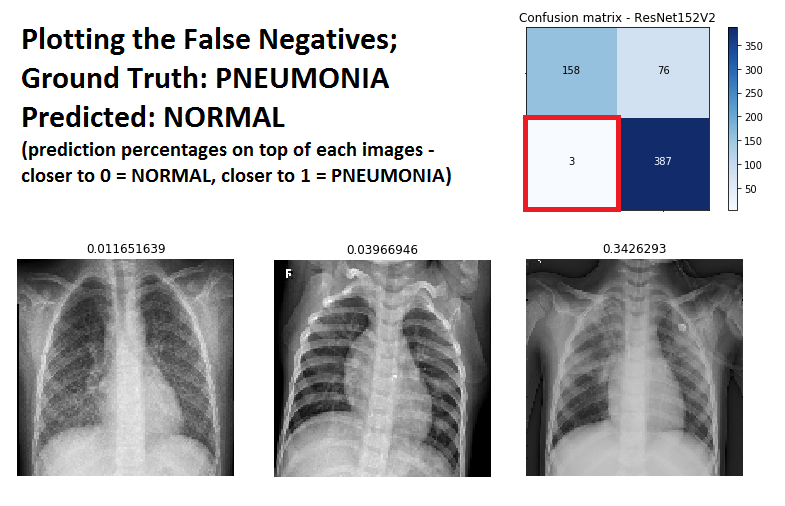

# Pneumonia Image Detection Classifier
### Mod 4 Project by Jagandeep Singh and Albert Um


# Project
For this project, our objective is to classify chest x-ray images by first training a Convoluted Neural Network and then predict the image to have pneumonia or not. <br>

When a patient is suspected to have pneumonia after clinical examination, it's acceptable to request a chest x-ray. Chest x-rays are useful when diagnosing pneumonia because it's quick, easy, and it can show doctors more than a clinical examination.

# Business Case:
1. Who is this applicable to?
    - Doctors
    - Students
2. What are we trying to identify?
    - Classify patients to have pneumonia, given their x-rays.
    - Differences of images that the CNN model has classified:
        - correctly (True Positives and True Negatives)
        - incorrectly (False Positives and False Negatives)

# Table of Contents
IMG -- contains images created for EDA
Models.ipynb -- contains our models
EDA.ipynb -- contains Exploratory Data Analysis

# Data
The original dataset can be found [here](https://www.kaggle.com/paultimothymooney/chest-xray-pneumonia) <br>

The original dataset directory:
```
chest_xray
└───test
│   └───NORMAL - 234 images
│   └───PNEUMONIA - 390 images
└───train
│   └───NORMAL - 1341 images
│   └───PNEUMONIA - 3877 images
└───val
    └───NORMAL - 8 images
    └───PNEUMONIA - 8 images
```
<div align="center">Differences between Normal and Pneumonia

</div>

When trying to detect pneumonia, it's better to first have an expectation of what should be there and then evaluate what's missing. For example, on the left plot, there are clear borders above the diaphragm(bottom of lungs) and its angles. There are also clear borders around the heart. On the right plot(Pneumonia), the borders have faded out and we see a lot of extra shadows.


# Preprocessing
Looking at the distribution of images available per folder, we need to address 2 things:<br>
1. Have more validation images
2. Handle class imbalance



### Have more validation images
We have moved all the validation images to the train folder.<br>
Once the classes (Normal and Pneumonia) have been balanced, we will train_test_split the images from the train folder to have our training images and validation images.

### Handle class imbalance
Due to class imbalance on the training set, we have augmented "new" NORMAL images to balance normal and pneumonia images. We have created new images by:<br>
- Blurr the original image
- Mirror the original image
- Sharpen the orginal image

<div align="center">NORMAL Original vs NORMAL Blurred Original

</div>

<div align="center">NORMAL Original vs NORMAL Mirrored Original

</div>

<div align="center">NORMAL Original vs NORMAL Sharpened Original

</div>


The augmented dataset directory:
```
chest_xray
└───test
│   └───NORMAL - 234 images
│   └───PNEUMONIA - 390 images
└───train
    └───NORMAL - 3885 images
    └───PNEUMONIA - 3885 images
```

# Modeling
We chose to focus on Recall as our primary metric because we are sensitive to False Negatives. (Model predicts normal but is actually pneumonia) We came to this conclusion, because we believe predicting someone to be normal when they were sick is more problematic than an instance of predicting a patient to be sick when they were not.

For our models, we used one of the pre-made Convolutional Layers from the Keras package accompanied with consistent dense layers.<br>
Constant Dense Layers:  <br>
- (1024,'relu'),
- (1024,'relu'),
- (512,'relu'),
- (1,'sigmoid') <br>

 </img>

<br>
We decided to use ResNet152V2 over the others because the recall and accuracy is relatively higher than the other pre-made layers. Although other models may have slightly higher recall, we concluded that the ResNet152V2 performed best overall.

 </img>

There were also 3 instances where the model predicted normal but but was actually pneumonia.

 </img>

# Conclusion
Our final model had an Accuracy of 87% and Recall of 98%. Our model was able to predict the unseen test set with minimal False Negatives. With 98% Recall our model is very good at identifying the actual positive(Pneumonia).

# Further Steps
We would like to train a model using multiple inputs to classify pneumonia. For example, in addition with a front chest x-rays, it would be interesting to input x-rays of the patient's side.

# Recommendations
1. Don't diagnose a patient of pneumonia with only a front chest x-ray. Use "probable."
2. Do use machine learning results as a teaching tool for medical students.
